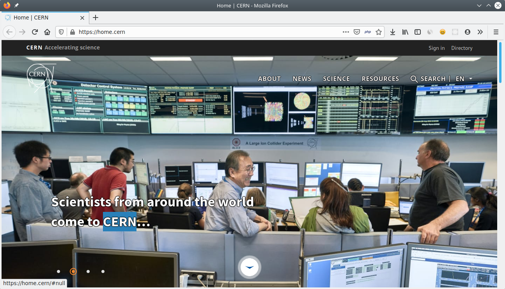
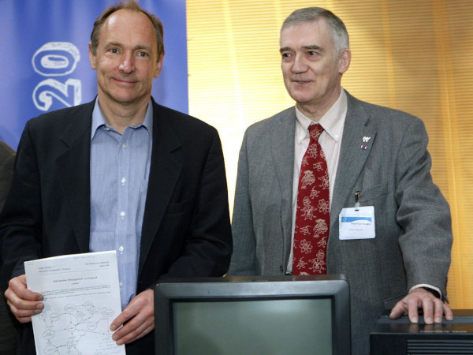

<!DOCTYPE html>
<html>
<head>
<title>Pengenalan HTML</title>
<link href="https://cdn.jsdelivr.net/npm/bootstrap@5.1.3/dist/css/bootstrap.min.css" rel="stylesheet" integrity="sha384-1BmE4kWBq78iYhFldvKuhfTAU6auU8tT94WrHftjDbrCEXSU1oBoqyl2QvZ6jIW3" crossorigin="anonymous">
</head>
<body>
    <nav class="navbar navbar-expand-lg bg-light">
        

          <a class="navbar-brand" href="index.html">Pengenalan</a>
          <button class="navbar-toggler" type="button" data-bs-toggle="collapse" data-bs-target="#navbarSupportedContent" aria-controls="navbarSupportedContent" aria-expanded="false" aria-label="Toggle navigation">
            
          </button>
          

            <ul class="navbar-nav me-auto mb-2 mb-lg-0">
              <li class="nav-item">
                <a class="nav-link active" aria-current="page" href="Tag.html">TAG</a>
              </li>
              <li class="nav-item">
                <a class="nav-link" href="element.html">ELEMENT</a>
              </li>
              <li>
                    <a class="nav-link" href="atribut.html">ATRIBUT</a>
              </li>
            </ul>
          

        

    </nav>
    

    </img>
<h1 style="font-family: Georgia, 'Times New Roman', Times, serif;">Apa itu HTML</h1>

 

Mari kita lihat pengertian HTML menurut wikipedia:

"HTML atau HyperText Markup Language merupakan sebuah bahasa markah untuk membuat halaman web."

<li>
    <ul>
        <b>Hypertext</b> adalah sebuah teks yang apabila diklik akan membawa seseorang berpindah dari satu dokumen ke dokumen lainnya. Dalam praktiknya, Hypertext diwujudkan dalam bentuk sebuah link yang bisa mengantar Anda ke dunia internet yang sangat luas.
    </ul>
</li>
<li>
    <ul>
        <b>Markup</b> adalah tag (semacam kode atau tanda) yang mengatur bagaimana website dikonstruksi. Layaknya sebuah rumah, kerangka dasar website itu diatur menggunakan HTML. Misalnya, HTML mengatur bagian head, di mana kode-kode program seperti Javascript ditulis, bagian mana yang akan terlihat di jendela browser, dan lain sebagainya, termasuk layout dan tampilan-tampilan visual yang kita lihat di dalam sebuah website.
    </ul>
</li>
<li>
    <ul>
        <b>Language</b> yang merupakan penunjuk bahwa HTML adalah sebuah bahasa. Namun demikian, HTML bukan bahasa pemrograman sebab tidak memilik ciri-ciri yang menunjukkan jika HTML adalah programming language seperti syntax, statement, dan lain seabagainya. Untuk gampangnya, HTML adalah bahasa tanda yang membangun kerangka website.
    </ul>
</li>

<h2 style="font-family: Georgia, 'Times New Roman', Times, serif;">Sejarah dan asal usul HTML</h2>

Cerita awal kemunculan HTML dimulai dari tahun 1980
     Saat itu seorang ilmuan bernama Tim Berners-Lee sedang bekerja di CERN.

    
</img>

    

     CERN sendiri bukanlah perusahaan yang berkaitan tentang teknologi maupun internet.
     CERN adalah singkatan dari bahasa prancis: Conseil Européen pour la Recherche Nucléaire.
     Yang artinya: Komisi Eropa untuk Penelitian Fisika Nuklir.

    
</img>

    

     Para peneliti di CERN membutuhkan sebuah cara atau sistem agar bisa saling berbagi dokumen hasil penelitian.
     Tim kemudian mencoba membuat ENQUIRE. Ini adalah software hypertext yang akan digunakan untuk berbagi dokumen.
     Lalu di tahun 1989, Tim memperkenalkan ide tentang hypertext berbasis internet. Ini nantinya akan menjadi cikal-bakal HTML.
     Tim kemudian memulai proyek baru dengan rekannya Robert Cailliau yang merupakan system engineer di CERN. Akan tetapi proyek ini tidak resmi diadopsi oleh CERN.

    
</img>

    
Pada akhir tahun 1991, Tim Berners-Lee menerbitkan dokumen yang berjudul: “HTML Tags”.
      Dokumen ini berisi penjelasan tentang 18 tags awal yang menjadi konsep dasar HTML.
     HTML sebenarnya dirancang berdasarkan pada konsep bahasa markup yang dikenal dengan SGML (Standard Generalized Markup Language).
     SGML adalah sebuah standar internasional untuk membuat dokumen dengan tanda (markup) seperti paragraf, list, heading, dan lain-lain.
     Bisa dibilang..
     HTML adalah implementasi dari SGML.

</body>
</html>
